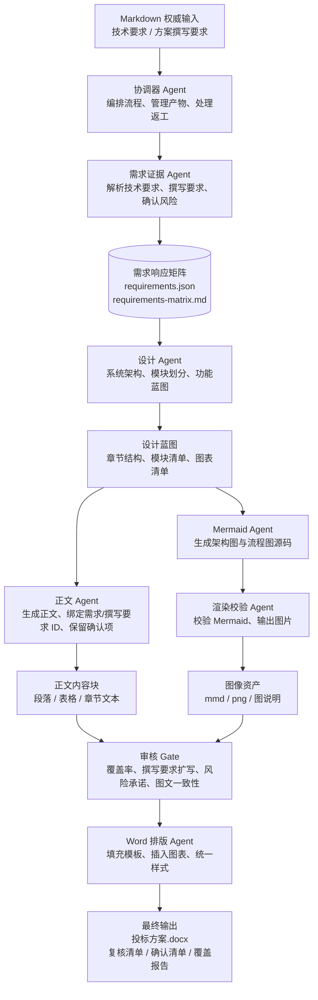

# 投标方案生成多 Agent 系统设计

## 1. 设计目标

本系统不是普通文本生成器，而是一条面向投标方案初稿的受控生产流水线。它的核心任务不是让模型自由写作，而是把已人工审核的 Markdown 技术要求、方案撰写要求和 Word 模板组织成可追溯、可复核、可交付的方案文档。

设计目标如下：

- 需求可追溯：所有正文、图表和响应说明都应能回到 `requirements.json` 或 `requirements-matrix.md` 中的技术需求编号、方案撰写要求编号、评分项编号或人工确认项。
- 内容可复核：涉及人员、资质、业绩、报价、服务承诺、质量保证期、交付周期等高风险内容，不允许自动编造，必须保留 `CONFIRM` 或进入 `REVIEW`。
- 图文一致：架构图、流程图和正文描述必须使用同一份设计蓝图与需求矩阵，避免图中模块和正文模块不一致。
- Word 交付稳定：最终 `.docx` 只由 Word 排版 Agent 统一装配，其他 Agent 不直接修改 Word 文件。
- 失败可恢复：所有中间产物先写入 staging 区，校验通过后再发布到正式输出目录，避免一次失败破坏上一次可用成果。
- 多窗口可并行：每个子 Agent 都有明确输入、输出、禁止事项和验收标准，便于多个窗口分别设计和实现。

核心原则：

> 协调器统一编排，需求矩阵作为事实源，正文和图表并行生成，审核 Gate 统一放行，Word 只在最后装配一次。

## 2. 总体架构

系统采用竖向、紧凑的流水线结构。主链路从输入资料开始，经需求证据、设计蓝图、正文与图表并行生成、审核 Gate、Word 装配，最后输出投标方案初稿和过程记录。



## 3. 数据流与产物链路

### 3.1 主链路

```text
input/技术要求.md
input/方案撰写要求.md
-> requirements.json
-> requirements-matrix.md
-> design-blueprint.json
-> content-blocks.json
-> diagrams/*.mmd
-> diagrams/*.png
-> review-report.md
-> output/*.docx
```

### 3.2 建议目录结构

```text
input/
  技术要求.md
  方案撰写要求.md

templates/
  投标方案模板.docx
  生成规则.md
  模板占位符说明.md

working/
  agent-system/
    staging/
      requirements/
      design/
      content/
      diagrams/
      review/
      assembly/
    published/
      requirements/
      design/
      content/
      diagrams/
      review/

output/
  records/
    requirements.json
    requirements-matrix.md
    design-blueprint.json
    content-blocks.json
    diagram-manifest.json
    review-report.md
    人工确认清单.md
    复核清单.md
    coverage-check.md
  *.docx
```

### 3.3 发布规则

- Agent 产物先写入 `working/agent-system/staging/<stage>/`。
- 单阶段校验通过后，由协调器发布到 `working/agent-system/published/<stage>/` 或 `output/records/`。
- 旧产物不在流程开始时删除；需要清理时只清理当前 run 的 staging 目录。
- `output/*.docx` 仅在审核 Gate 通过后生成。
- 每次运行应保留 run id、时间戳、输入文件摘要和主要产物路径，方便回溯。

## 4. Agent 职责设计

### 4.1 Coordinator Agent

目标：负责任务编排、阶段调度、产物检查和失败恢复，是系统的唯一流程控制者。

输入：

- 用户启动指令或自动化任务配置。
- `input/技术要求.md`、`input/方案撰写要求.md`、`templates/*`。
- 各子 Agent 的阶段产物与状态报告。

输出：

- run manifest。
- 阶段调度结果。
- 发布后的中间产物清单。
- 失败恢复或返工指令。

允许做什么：

- 检查输入文件是否存在。
- 创建 staging 和 published 目录。
- 调用或调度各子 Agent。
- 判断阶段产物是否齐全。
- 在审核失败时把问题路由回对应 Agent。

禁止做什么：

- 不直接编写正文。
- 不直接生成 Mermaid 语义内容。
- 不直接修改 Word 文档正文含义。
- 不绕过 Review Gate 生成最终 Word。

失败条件：

- 必需输入缺失。
- 上游阶段产物缺失或格式无效。
- Review Gate 未通过。
- Word 装配失败且没有可用回退产物。

验收标准：

- 能清晰记录每个阶段的输入、输出、状态和错误。
- 同一 run 的产物路径可追踪。
- 失败后不会删除上一次已发布的可用产物。

### 4.2 Requirement Evidence Agent

目标：把人工审核后的技术要求 Markdown 和方案撰写要求 Markdown 整理成全流程事实源，生成需求响应矩阵和人工确认风险清单。

输入：

- `input/技术要求.md`
- `input/方案撰写要求.md`
- `templates/生成规则.md`
- `templates/模板占位符说明.md`

输出：

- `requirements.json`
- `requirements-matrix.md`
- `confirm-candidates.md`
- `extraction-warnings.md`

允许做什么：

- 解析功能、性能、非功能、接口、设计约束等技术要求。
- 解析方案撰写要求，生成 `WRNNN` ID，并自动推断目标章节。
- 为每条要求生成稳定 ID。
- 标记需求类别、主题、关键词、对应章节、是否需要图。
- 对低置信度章节映射生成复核事项。
- 标记需要人工确认或复核的高风险内容。
- 记录抽取不完整、疑似截断、跨行断句等问题。

禁止做什么：

- 不生成投标正文。
- 不擅自补全缺失指标、标准号、日期、人员、资质或承诺。
- 不把无法确认的信息写成确定事实。

失败条件：

- 核心 Markdown 输入无法读取。
- 需求 ID 重复。
- 方案撰写要求 ID 重复。
- 抽取结果为空或明显缺失关键章节。
- 发现疑似截断但未记录 warning。

验收标准：

- 每条需求有唯一 ID。
- 每条方案撰写要求有唯一 `WRNNN` ID、原文、自动目标章节和覆盖状态。
- 每条需求至少有一个建议响应章节或明确标记为待确认。
- `CONFIRM` 候选项被单独列出。

### 4.3 Design Agent

目标：基于需求矩阵生成系统架构、模块划分、章节结构、功能蓝图和图表清单。

输入：

- `requirements.json`
- `requirements-matrix.md`
- 模板占位符清单。
- 生成规则。

输出：

- `design-blueprint.json`
- `section-plan.md`
- `diagram-plan.json`

允许做什么：

- 规划总体架构层次。
- 归并功能模块。
- 设计章节结构和每章覆盖的需求 ID。
- 定义需要生成的架构图、流程图和说明图。
- 为正文 Agent 提供写作蓝图。

禁止做什么：

- 不直接输出最终正文。
- 不直接生成 Mermaid 源码。
- 不改变需求原文含义。
- 不合并掉必须单独响应的评分项。

失败条件：

- 章节计划没有覆盖全部关键需求。
- 图表计划没有绑定来源需求 ID。
- 功能模块划分与需求主题明显不一致。

验收标准：

- 每个章节有目的、输入需求 ID、输出内容类型。
- 每个功能模块有模块名、职责、相关需求 ID、建议图表。
- 每张图有 `diagram_id`、标题、类型、来源需求 ID 和用途说明。

### 4.4 Content Agent

目标：根据设计蓝图生成可装配的正文内容块，确保每段内容可追溯、可复核、不过度承诺。

输入：

- `requirements.json`
- `requirements-matrix.md`
- `design-blueprint.json`
- `section-plan.md`
- 模板占位符清单。

输出：

- `content-blocks.json`
- `content-preview.md`
- `content-review-notes.md`

允许做什么：

- 为 `GEN` 占位符生成正文段落、表格和章节文本。
- 为每个内容块绑定 `requirement_ids` 或 `scoring_item_ids`。
- 对 `REVIEW` 内容生成初稿并标记复核。
- 对高风险事实保留 `CONFIRM`。

禁止做什么：

- 不生成或修改 Mermaid 源码。
- 不插入 Word。
- 不把 `CONFIRM` 占位符替换为猜测内容。
- 不声称无偏离、完全满足、特定资质、固定人员、固定价格或确定承诺，除非输入资料明确提供。

失败条件：

- 正文内容块缺少来源 ID。
- 出现未依据输入资料的厂商、型号、人员、资质、业绩、报价或承诺。
- `REVIEW` 内容没有进入复核记录。

验收标准：

- 每个内容块有 `block_id`、`placeholder`、`type`、`content`、`source_ids`。
- 段落正式、稳健、符合投标文档表达习惯。
- 风险内容明确进入 `CONFIRM` 或 `REVIEW`。

### 4.5 Mermaid Agent

目标：根据设计蓝图和需求 ID 生成架构图、功能流程图等 Mermaid 源码。

输入：

- `requirements.json`
- `design-blueprint.json`
- `diagram-plan.json`
- 必要的示例图风格约束。

输出：

- `diagrams/*.mmd`
- `diagram-specs.json`
- `diagram-descriptions.md`

允许做什么：

- 生成 `flowchart TB` 或 `flowchart TD` 为主的竖向图。
- 为每张图提供标题、说明和来源需求 ID。
- 根据图类型选择架构层、流程节点、数据流和审核提示。
- 在 `--allow-local-draft` 开发验收模式下，基于 `diagram-plan.json`、设计蓝图和需求矩阵生成确定性的本地 Mermaid 草稿，用于无 LLM 环境下跑通全流程。

禁止做什么：

- 不直接生成 PNG。
- 不修改正文。
- 不把缺失事实画成确定组件、厂商、型号或承诺。
- 不生成过宽、过密、横向难读的图，除非确有必要。
- 本地草稿模式不得引入输入资料、设计蓝图或图表计划之外的事实。

失败条件：

- Mermaid 代码不是 `flowchart TB`、`flowchart TD` 或其他明确允许的图类型。
- 图没有绑定来源需求 ID。
- 图中节点与设计蓝图明显不一致。
- 图过度泛化，无法体现本项目业务特点。

验收标准：

- 每张图有独立 `.mmd` 文件。
- 每张图有 `source_requirement_ids`、`description`、`review_notes`。
- 架构图和流程图优先采用竖向紧凑布局。

### 4.6 Render Validate Agent

目标：对 Mermaid 源码进行语法校验、原生渲染、图片质量检查和失败记录。

输入：

- `diagrams/*.mmd`
- `diagram-specs.json`

输出：

- `diagrams/*.png`
- `diagram-render-log.md`
- `diagram-manifest.json`

允许做什么：

- 调用 Mermaid CLI 或其他渲染工具。
- 检查 Mermaid 语法、渲染状态、图片是否存在。
- 检查图片尺寸、可读性和空白图风险。
- 在渲染失败时记录错误。
- 必要时生成降级图，但必须标记为降级渲染。

禁止做什么：

- 不改写图的业务语义。
- 不把降级图标记为原生 Mermaid 渲染成功。
- 不删除上一次已发布的可用图。

失败条件：

- Mermaid 无法解析。
- PNG 未生成或为空。
- 降级渲染没有在 `render_status` 中标记。
- 图片路径与 manifest 不一致。

验收标准：

- 每张 `.mmd` 至少对应一条渲染记录。
- 成功图有有效 `image_path`。
- 失败图有错误原因、建议处理方式和是否可继续装配的判断。

### 4.7 Review Gate Agent

目标：作为最终发布前的质量门禁，检查技术要求覆盖、方案撰写要求扩写、评分项响应、风险承诺、图文一致性和占位符状态。

输入：

- `requirements.json`
- `requirements-matrix.md`
- `design-blueprint.json`
- `content-blocks.json`
- `diagram-manifest.json`
- `placeholder-fill-log.md` 或待装配占位符清单。

输出：

- `review-report.md`
- `coverage-check.md`
- `人工确认清单.md`
- `复核清单.md`
- `release-decision.json`

允许做什么：

- 检查需求是否覆盖。
- 检查方案撰写要求是否全部扩写进入正文内容块。
- 检查低置信度自动章节映射是否进入复核清单。
- 检查评分项是否响应。
- 检查正文是否存在无来源事实。
- 检查 `CONFIRM` 是否被错误替换。
- 检查 `REVIEW` 是否进入复核清单。
- 检查图表说明、图片和正文是否一致。
- 决定是否允许进入 Word 装配。

禁止做什么：

- 不直接改正文。
- 不直接改图。
- 不直接改 Word。
- 不在发现阻断问题时放行。

失败条件：

- 存在未覆盖关键需求。
- 存在未扩写的方案撰写要求。
- 存在未响应评分项。
- 存在虚构人员、资质、业绩、报价或承诺。
- 存在未标记的 Mermaid 降级渲染。
- Word 装配前仍有未解释的高风险占位符。

验收标准：

- 输出明确的 `approved` 或 `blocked`。
- 每个问题有严重级别、来源、责任 Agent 和建议修复方向。
- 所有保留的 `CONFIRM` 和 `REVIEW` 均进入对应清单。

### 4.8 Word Layout Agent

目标：消费审核通过的内容块、图像资产和记录文件，复制模板并生成最终 Word 初稿。

输入：

- `templates/投标方案模板.docx`
- `content-blocks.json`
- `diagram-manifest.json`
- `requirements.json`
- `review-report.md`
- `release-decision.json`

输出：

- `output/<项目名称>设计方案_V1.00_<YYYYMMDD>.docx`
- `placeholder-fill-log.md`
- `assembly-log.md`
- 最终残留占位符检查结果。

允许做什么：

- 复制 Word 模板到输出目录。
- 替换 `COPY` 和 `GEN` 占位符。
- 插入段落、表格和图片。
- 保留 `CONFIRM` 占位符。
- 插入或更新过程记录。
- 检查未处理占位符。

禁止做什么：

- 不判断正文事实是否正确。
- 不重写正文含义。
- 不擅自替换 `CONFIRM`。
- 不在 Review Gate 未通过时生成最终版。

失败条件：

- 模板缺失。
- 必需占位符未找到且未记录。
- 图片路径无效。
- `.docx` 保存失败。
- 最终 Word 中存在未解释的异常占位符。

验收标准：

- Word 文件可打开。
- 关键占位符处理结果进入 `placeholder-fill-log.md`。
- 图片、表格、段落顺序与内容块一致。
- `CONFIRM` 和 `REVIEW` 状态与审核记录一致。

## 5. 中间产物契约

### 5.1 Requirement Item

```json
{
  "id": "T001",
  "source_file": "input/技术要求.md",
  "category": "技术要求-功能",
  "title": "海图综合态势展示",
  "text": "原文摘录或归纳后的完整要求",
  "keywords": ["标准", "数据"],
  "target_sections": ["总体架构设计", "功能设计章节"],
  "need_diagram": true,
  "risk_level": "normal",
  "status": "extracted",
  "warnings": []
}
```

### 5.2 Writing Requirement Item

```json
{
  "writing_requirement_id": "WR001",
  "source_file": "input/方案撰写要求.md",
  "title": "总体架构设计完整性",
  "text": "系统总体、业务、逻辑、技术、数据架构设计需具备全面性、合理性，以及配置灵活性。",
  "target_sections": ["总体架构设计"],
  "mandatory_expansion": true,
  "mapping_confidence": "high",
  "coverage_status": "planned",
  "status": "extracted"
}
```

### 5.2 Design Blueprint

```json
{
  "project_name": "电子海图显示与信息系统",
  "architecture_layers": [
    {
      "layer_id": "L1",
      "name": "用户访问层",
      "responsibility": "提供用户操作入口和显示交互能力",
      "source_requirement_ids": ["T001", "T008"]
    }
  ],
  "modules": [
    {
      "module_id": "M001",
      "name": "海图综合态势展示",
      "responsibility": "负责海图数据加载、显示控制和态势叠加",
      "source_requirement_ids": ["T001", "T007", "T008"],
      "suggested_diagrams": ["D001"]
    }
  ],
  "sections": [
    {
      "placeholder": "【GEN:功能设计章节】",
      "section_title": "功能设计",
      "content_type": "dynamic_sections",
      "source_requirement_ids": ["T001", "T007"]
    }
  ]
}
```

### 5.3 Content Block

```json
{
  "block_id": "CB001",
  "placeholder": "【GEN:总体架构设计】",
  "type": "paragraphs",
  "content": [
    "本系统总体架构围绕电子海图显示、目标信息融合、航行监控预警和数据维护合规等能力展开..."
  ],
  "source_requirement_ids": ["T001", "T007", "P001"],
  "scoring_item_ids": ["S001"],
  "review_required": false,
  "confirm_required": false
}
```

### 5.4 Diagram Spec

```json
{
  "diagram_id": "D001",
  "title": "总体架构图",
  "kind": "architecture",
  "mermaid_path": "output/records/architecture.mmd",
  "image_path": "output/records/architecture.png",
  "source_requirement_ids": ["T001", "T007", "Q001"],
  "description": "本图描述系统从用户访问、业务应用、平台能力、数据资源到安全运维的总体关系。",
  "render_status": "native_rendered",
  "review_notes": []
}
```

### 5.5 Review Issue

```json
{
  "issue_id": "R001",
  "severity": "blocking",
  "category": "unsupported_claim",
  "message": "正文出现未在输入资料中确认的服务响应时限。",
  "source": "content-blocks.json#CB018",
  "owner_agent": "Content Agent",
  "suggested_action": "改为 REVIEW 或 CONFIRM，并进入复核清单。"
}
```

### 5.6 Assembly Manifest

```json
{
  "project_name": "电子海图显示与信息系统",
  "template_path": "templates/投标方案模板.docx",
  "output_docx": "output/电子海图显示与信息系统设计方案_V1.00_20260530.docx",
  "content_blocks_path": "output/records/content-blocks.json",
  "diagram_manifest_path": "output/records/diagram-manifest.json",
  "review_decision": "approved",
  "placeholders": [
    {
      "placeholder": "【GEN:总体架构图】",
      "status": "filled",
      "source": "D001"
    }
  ]
}
```

## 6. 并行开发切分

### 窗口 1：需求证据 Agent

负责设计和实现 Markdown 输入解析、需求 ID 规则、方案撰写要求 ID 规则、需求矩阵、确认风险识别和抽取 warning。该窗口的核心交付物是 `requirements.json` 和 `requirements-matrix.md`。

### 窗口 2：Design Agent

负责设计蓝图结构、章节计划、模块划分、图表计划、需求覆盖映射和方案撰写要求自动章节映射。该窗口不生成正文，只输出可供正文和 Mermaid 使用的设计骨架。

### 窗口 3：Content Agent

负责正文内容块格式、占位符映射、正文生成规则、来源 ID 绑定、方案撰写要求扩写和风险内容保留策略。该窗口交付 `content-blocks.json` 和可读预览。

### 窗口 4：Mermaid + Render Validate

负责图表计划消费、 Mermaid 源码生成、竖向紧凑布局规则、 Mermaid 语法校验、图片渲染、降级渲染标记和图表 manifest。

### 窗口 5：Review Gate

负责覆盖率、方案撰写要求扩写、评分项响应、无依据事实、承诺风险、图文一致性、降级渲染、占位符残留等检查规则。该窗口交付 `review-report.md` 和 `release-decision.json`。

### 窗口 6：Word Layout

负责模板复制、占位符替换、段落表格图片插入、样式保持、残留占位符检查和最终 `.docx` 输出。该窗口只消费审核通过的内容。

### 并行约束

- 每个窗口只写自己负责的 staging 子目录。
- 公共契约变更必须先更新本文档或单独的 schema 文件。
- 不允许两个窗口同时修改最终 Word 产物。
- 不允许任何窗口绕过 `requirements.json` 自行解释输入资料并生成最终内容。

## 7. 审核 Gate 规则

Review Gate 必须拦截以下问题：

- 未覆盖需求：`requirements.json` 中的关键需求没有映射到正文、图表或复核项。
- 未扩写方案撰写要求：`writing_requirements` 中的条目没有进入正文内容块或复核清单。
- 低置信度映射未复核：系统自动章节映射置信度为 low 的 `WRNNN` 未进入复核清单。
- 未响应评分项：评分表中的高分项没有明确章节响应。
- 虚构事实：出现输入资料未提供的人员、资质、业绩、报价、品牌、型号、日期、服务承诺。
- `CONFIRM` 被错误替换：需要人工确认的内容被自动填成确定值。
- `REVIEW` 未进入复核清单：可生成初稿但需复核的内容没有被记录。
- 图和正文不一致：图中的模块、流程、数据流与正文或设计蓝图不一致。
- Mermaid 降级渲染未标记：非原生渲染图未在 `render_status` 中说明。
- Word 残留未处理占位符：最终装配前存在未解释、未记录的占位符。
- 来源 ID 缺失：正文块、图表说明或关键表格没有绑定需求 ID、方案撰写要求 ID 或评分项 ID。
- 过度承诺：正文使用“完全满足”“保证”“无偏离”等确定性表达但缺少输入依据。

Review Gate 输出必须包含：

- `approved` 或 `blocked`。
- 问题列表。
- 每个问题的严重级别。
- 责任 Agent。
- 建议修复动作。
- 是否允许继续 Word 装配。

## 8. 失败恢复策略

### 8.1 Staging 优先

所有 Agent 都先写 staging 目录。只有当该阶段产物通过格式校验和基本质量校验后，协调器才发布到 published 或 `output/records/`。

### 8.2 不提前删除旧成果

流程开始时不得删除旧的 `.mmd`、`.png`、`.json`、`.docx` 正式产物。需要清理时，只清理当前 run 的 staging 目录。这样可以避免 LLM 调用失败、Mermaid 渲染失败或 Word 装配失败时丢失上一次可用结果。

### 8.3 按阶段恢复

- 需求抽取失败：停止后续阶段，保留错误报告。
- 设计失败：保留已发布的需求矩阵，重新生成设计蓝图。
- 正文失败：只重跑 Content Agent。
- 图表失败：只重跑 Mermaid Agent 或 Render Validate Agent。
- 审核失败：根据问题责任回退到对应 Agent。
- Word 失败：不重跑上游内容，优先修复模板或装配逻辑。

### 8.4 降级策略

- Mermaid 原生渲染失败时，可以生成降级图片，但必须标记 `render_status: fallback_rendered`。
- 降级图片是否允许进入 Word，由 Review Gate 决定。
- 缺少人工确认信息时，不阻塞初稿生成，但必须保留 `CONFIRM` 并写入人工确认清单。

## 9. 实施优先级

### 第一期：固化契约和审核 Gate

目标是先把全流程的事实源和质量门槛稳定下来。

- 完善 `requirements.json` 和 `requirements-matrix.md` 字段。
- 新增或固化 `design-blueprint.json`、`content-blocks.json`、`diagram-manifest.json` 的 schema。
- 实现 Review Gate 的基础检查。
- 确认 `CONFIRM` 和 `REVIEW` 的记录规则。

### 第二期：拆 Mermaid、正文、Word 排版

目标是将现有串行脚本中的高耦合逻辑拆成清晰阶段。

- Mermaid 生成和渲染分离。
- 正文生成改为内容块产物。
- Word 排版只消费内容块和图表 manifest。
- 输出记录统一由协调器或装配阶段汇总。

### 第三期：引入协调器和多窗口并行执行

目标是支持多个子 Agent 或多个窗口独立工作。

- 引入 run manifest 和阶段状态。
- 将每个 Agent 的 staging 目录隔离。
- 实现失败后按阶段重跑。
- 支持并行生成正文和图表。
- 将 Review Gate 作为发布前强制步骤。

## 10. 公共接口约束

- `requirements.json` 是全流程事实源。
- 所有正文段落必须能关联 `requirement_ids`、`writing_requirement_ids` 或 `scoring_item_ids`。
- 所有图表必须输出 `diagram_id`、`title`、`kind`、`mermaid_path`、`image_path`、`source_requirement_ids`、`description`、`render_status`。
- Word 排版 Agent 不判断内容正确性，只消费审核通过的内容和图片。
- Review Gate 是最终发布前唯一放行点。
- `CONFIRM` 信息不得由任何生成 Agent 自动补齐。
- Mermaid 图默认采用竖向 `flowchart TB` 或 `flowchart TD`，优先紧凑可读。
- 任何 Agent 发现输入依据不足时，应输出 warning 或 review issue，而不是自行补全。

## 11. 测试计划

使用现有样例输入执行端到端验证：

- `input/技术要求.md` 或唯一匹配的 `input/*技术要求.md`
- `input/方案撰写要求.md`

本地闭环验收命令：

```powershell
python working\agents\coordinator_agent.py --allow-local-draft --renderer-command __missing_mmdc__
```

该模式不依赖外部 LLM/API：Content Agent 和 Mermaid Agent 使用确定性本地草稿；`--renderer-command __missing_mmdc__` 用于本地测试时跳过原生 Mermaid CLI 并走已标记的 fallback PNG。生产模式仍通过各自唯一的 `call_llm_api()` 接口接入真实 LLM，并建议配置 Mermaid CLI。

检查项：

- 每个需求 ID 是否进入矩阵并至少映射到一个章节、图表或复核项。
- 每个方案撰写要求 ID 是否进入矩阵并扩写进入正文内容块。
- 低置信度自动章节映射是否进入 `复核清单.md`。
- 每个评分项是否被明确响应。
- 正文内容块是否带来源 ID。
- `diagram-specs.json` 是否生成，且每张 `.mmd` 首行为 `flowchart TB` 或 `flowchart TD`，不包含 Markdown 代码围栏。
- `diagram-manifest.json` 是否生成；如缺少 Mermaid CLI 而走降级 PNG，是否记录 `fallback_rendered`、错误原因和复核说明。
- `CONFIRM` 是否被保留并进入 `人工确认清单.md`。
- `REVIEW` 是否进入 `复核清单.md`。
- Mermaid 是否能原生渲染；如降级渲染，是否记录 `fallback_rendered`。
- 图表说明是否与正文模块一致。
- Word 中图片、表格、段落顺序是否正确。
- Word 中是否存在未解释的占位符残留。
- `人工确认清单.md`、`复核清单.md`、`coverage-check.md` 是否与最终文档一致。
- `run-manifest.json` 中所有执行阶段是否为 `published`，`release-decision.json` 是否为 `approved`，`assembly-manifest.json` 是否为 `generated` 并指向真实 `.docx`。

## 12. 默认假设

- 本文档只描述多 Agent 系统设计，不立即要求重构现有 Python 脚本。
- 各子 Agent 可以先独立设计与实现，再回到协调器集成。
- 现有 `working/generate_bid_solution.py` 可作为初期单体参考实现，后续按阶段逐步拆分。
- 现有 `output/records/` 中的过程记录继续作为正式交付记录位置。
- 所有新增阶段产物在进入正式输出前应先经过 staging。
- 图表优先采用竖向紧凑布局，避免横向展开导致 Word 中不可读。
