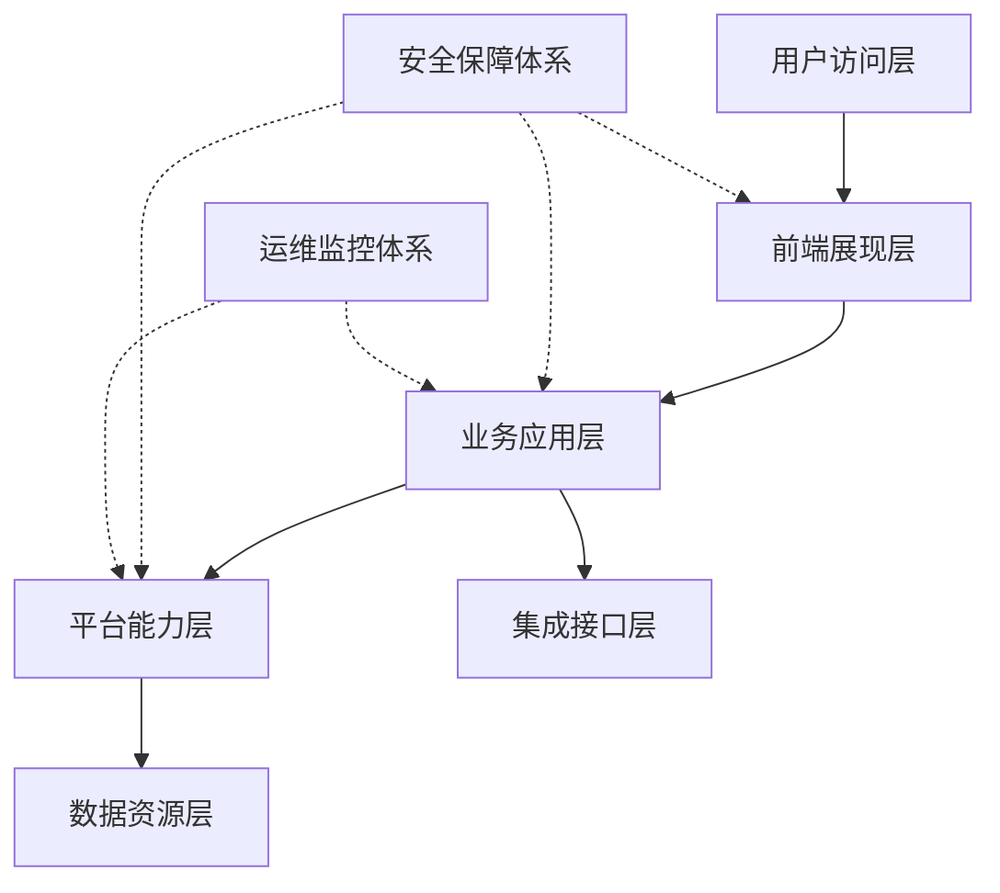
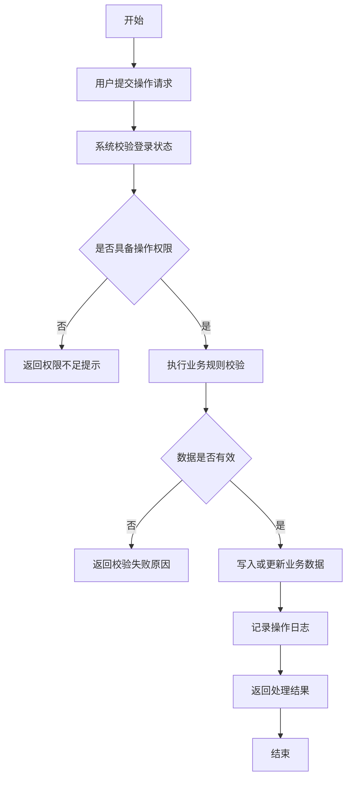

# 生成规则

本文档用于约束 Codex 根据招标文件、商务要求、技术评分表和投标方案模板生成方案设计文档初稿时的写作方式、内容结构、图表要求和质量检查标准。

## 1. 总体生成原则

生成内容必须遵循以下原则：

- 以招标文件、技术要求、商务要求和技术评分表为事实依据。
- 先建立需求响应矩阵，再生成方案正文。
- 优先覆盖评分表中的高分关键词和明确评分项。
- 不编造厂商、型号、报价、人员、证书、案例、资质、承诺日期等事实信息。
- 对不确定信息使用 `【CONFIRM:xxx】` 保留占位符。
- 正文语言应正式、稳健、专业、可落地，符合投标文件表达习惯。
- 避免使用“可能”“大概”“建议”“尝试”“尽量”等不确定表达。
- 避免泛泛而谈，每个功能设计都应体现实现路径、业务流程、数据处理、安全控制和响应关系。

## 2. 推荐工作流程

每次生成方案时，按以下顺序执行：

1. 读取 `input/技术要求.docx`、`input/商务要求.docx`、`input/技术评分表.docx`。
2. 读取 `templates/投标方案模板.docx`、`templates/模板占位符说明.md`、`templates/生成规则.md`。
3. 提取技术要求、商务要求和评分项，生成 `output/records/requirements-matrix.md`。
4. 解析模板中的 `COPY`、`GEN`、`CONFIRM`、`OPTIONAL`、`REVIEW` 占位符。
5. 先处理 `COPY` 和 `CONFIRM`，确定事实来源和人工确认项。
6. 再处理 `GEN`，生成方案正文、Mermaid 源码和图像。
7. 将生成内容和图片填入模板副本，输出 `.docx` 初稿。
8. 生成过程记录，包括占位符填充日志、人工确认清单、复核清单和 Mermaid 源码。
9. 检查招标要求和评分项是否全部覆盖。

## 3. 需求响应矩阵规则

生成正文前，必须先建立需求响应矩阵。

矩阵建议字段：

| 字段 | 说明 |
|---|---|
| 编号 | 自动编号或招标文件原编号 |
| 来源文件 | 技术要求、商务要求或技术评分表 |
| 要求类型 | 技术要求、商务要求、评分项 |
| 原文摘录 | 对应要求原文或关键摘录 |
| 关键词 | 功能、性能、安全、接口、运维、服务等关键词 |
| 响应策略 | 复制引用、功能设计、架构设计、商务响应、人工确认 |
| 对应章节 | 方案中的章节或占位符 |
| 是否生成图 | 是/否 |
| 状态 | 已覆盖、待确认、缺少来源 |

处理要求：

- 每条技术要求必须能映射到至少一个方案章节。
- 每条评分项必须能映射到正文中的明确响应内容。
- 高分评分项应优先在架构设计、功能设计和保障措施中强化表达。
- 对无法判断的内容标记为 `待确认`，不得忽略。

## 4. 项目理解生成规则

适用占位符：

```text
【GEN:项目理解】
【GEN:建设背景】
【GEN:建设目标】
【GEN:总体设计原则】
```

生成要求：

- 结合招标技术要求和商务要求，概括项目建设背景、建设目标和建设重点。
- 不得凭空编造采购单位现状。
- 可使用“围绕招标文件提出的建设要求”“结合本项目业务特点”等稳健表达。
- 应体现对业务、技术、管理、运维、安全等方面的整体理解。
- 每个主题建议生成 3-5 段，每段 120-220 字。

推荐结构：

```text
第一段：项目建设背景和总体定位。
第二段：核心建设目标。
第三段：技术建设重点。
第四段：管理和运维保障重点。
第五段：对评分项或关键要求的响应总结。
```

## 5. 总体架构设计生成规则

适用占位符：

```text
【GEN:总体架构设计】
【GEN:应用架构设计】
【GEN:数据架构设计】
【GEN:集成架构设计】
【GEN:安全架构设计】
【GEN:部署架构设计】
【GEN:运维保障设计】
```

生成要求：

- 总体架构设计应采用分层架构描述。
- 每个架构主题使用大段正式文字，不要只列提纲。
- 每段应说明该层的职责、组成、实现方式、与招标要求的对应关系。
- 总体架构设计建议 5-8 段，每段 150-260 字。
- 专项架构设计建议每项 2-4 段，每段 120-220 字。

总体架构建议包含：

- 用户访问层
- 前端展现层
- 业务应用层
- 平台能力层
- 数据资源层
- 集成接口层
- 安全保障体系
- 运维监控体系
- 基础设施层

写作要求：

- 明确体现系统的扩展性、可靠性、安全性、可维护性和可运营性。
- 如招标文件涉及国产化、信创、等保、数据安全、接口集成、性能要求，应在架构中明确响应。
- 不出现无法确认的具体品牌、型号或云厂商名称。

## 6. 总体架构图生成规则

适用占位符：

```text
【GEN:总体架构图】
```

生成要求：

- 使用 Mermaid 生成架构图源码。
- 默认使用 `flowchart TB` 或 `flowchart LR`。
- 图中节点应使用中文。
- 架构图应体现分层关系、数据流向、接口集成、安全与运维支撑。
- Mermaid 源码保存为 `output/records/architecture.mmd`。
- 渲染图片保存为 `output/records/architecture.png`。
- 图片应插入到 `.docx` 中对应位置。

推荐 Mermaid 结构：



注意：

- 实际生成时应根据招标文件内容调整节点。
- 不要让图过度复杂，建议 10-25 个核心节点。
- Mermaid 源码必须能被正常渲染。

## 7. 功能设计生成规则

适用占位符：

```text
【GEN:功能设计-*】
```

生成要求：

- 每个功能必须对应招标技术要求中的一项或多项要求。
- 每个功能建议不少于 700 字；核心评分功能建议不少于 1000 字。
- 不要只描述“系统支持某功能”，必须说明如何实现。
- 每个功能应包含业务目标、建设内容、实现方式、流程逻辑、数据处理、安全控制、异常处理和响应说明。

推荐结构：

```text
一、功能目标
说明该功能解决什么业务问题，对应哪些招标要求。

二、建设内容
说明功能模块、页面能力、操作对象、业务规则和输出结果。

三、实现方式
说明前端、后端、数据、接口、权限、日志等实现路径。

四、业务流程
说明用户操作、系统校验、数据流转、结果反馈和异常处理。

五、数据处理逻辑
说明数据采集、录入、查询、统计、校验、存储、更新、归档等逻辑。

六、权限与安全控制
说明角色权限、数据权限、操作审计、敏感信息保护等内容。

七、异常处理与运维保障
说明异常提示、失败回滚、日志记录、监控告警和运维排查方式。

八、招标要求响应说明
明确说明本功能如何满足对应技术要求和评分项。
```

写作风格：

- 使用“系统通过……实现……”“平台提供……能力”“模块支持……”等确定性表达。
- 避免空泛词，如“先进的”“完善的”“强大的”，除非后面有具体实现支撑。
- 对评分表中的关键词要自然嵌入正文。

## 8. 功能流程图生成规则

适用占位符：

```text
【GEN:流程图-*】
```

生成要求：

- 每个关键功能生成一张 Mermaid 流程图。
- 默认使用 `flowchart TD`。
- 流程图应包含开始、输入、校验、处理、判断、异常、结果反馈、日志记录或归档。
- 每张图建议 8-18 个节点。
- Mermaid 源码保存到 `output/records/`。
- 命名建议：

```text
output/records/function-001-用户管理.mmd
output/records/function-001-用户管理.png
```

推荐 Mermaid 结构：



注意：

- 实际生成时必须替换为对应功能的业务节点。
- Mermaid 节点文字应简洁，详细说明写在正文中。
- 流程图应与功能设计正文一致。

## 9. 商务响应生成规则

适用占位符：

```text
【GEN:商务响应-*】
```

生成要求：

- 以 `input/商务要求.docx` 为主要依据。
- 对服务期限、交付地点、付款方式、验收要求、售后服务、培训要求等进行响应。
- 涉及具体承诺、金额、日期、人员、资质的内容，如无用户资料，应使用 `【CONFIRM:xxx】`。
- 商务响应应稳健、合规，不得擅自承诺超出用户可确认范围的内容。

推荐结构：

```text
第一段：引用或概括商务要求。
第二段：说明响应原则和履约保障方式。
第三段：说明组织、流程、质量、交付或服务保障措施。
第四段：列出需要用户确认的具体承诺项。
```

## 10. 评分响应强化规则

适用占位符：

```text
【GEN:评分响应强化-*】
```

生成要求：

- 以 `input/技术评分表.docx` 为主要依据。
- 优先识别高分项、扣分项、加分项和明确评分关键词。
- 在正文中主动嵌入评分要求对应内容。
- 评分响应不应孤立堆砌，应融合到架构设计、功能设计、实施方案和保障措施中。

处理方式：

- 对架构类评分项，在总体架构、部署架构、安全架构中强化。
- 对功能类评分项，在对应功能设计中强化。
- 对实施服务类评分项，在实施方案、培训方案、售后服务方案中强化。
- 对文档完整性类评分项，在章节结构和响应矩阵中强化。

输出要求：

- 在 `output/records/requirements-matrix.md` 中标记评分项覆盖位置。
- 如果某评分项缺少可写依据，应标记为 `待确认`。

## 11. 实施方案生成规则

适用占位符：

```text
【GEN:实施方案】
【GEN:项目组织保障】
【GEN:进度计划】
【GEN:质量保障措施】
【GEN:风险控制措施】
```

生成要求：

- 根据商务要求和技术要求生成项目实施初稿。
- 不能编造具体人员姓名、证书编号、实际工期日期。
- 可生成通用但可落地的阶段安排，如启动准备、需求确认、设计开发、测试联调、上线试运行、验收交付、运维支持。
- 涉及具体时间周期时，如招标文件未明确，应使用 `【CONFIRM:实施周期】`。

推荐实施阶段：

```text
项目启动与计划编制
需求调研与确认
总体设计与详细设计
系统开发与配置
数据准备与接口联调
系统测试与问题整改
上线部署与试运行
项目验收与资料移交
运维服务与持续优化
```

## 12. 培训和售后服务生成规则

适用占位符：

```text
【GEN:培训方案】
【GEN:售后服务方案】
【GEN:运维服务方案】
```

生成要求：

- 根据商务要求生成服务方案。
- 如招标文件明确响应时间、服务期限、培训次数，应原文引用或准确响应。
- 如未明确，应使用稳健表述，并将具体承诺项标记为 `【CONFIRM:xxx】`。

培训方案建议包括：

- 培训对象
- 培训内容
- 培训方式
- 培训资料
- 培训考核
- 培训效果跟踪

售后服务方案建议包括：

- 服务组织
- 服务渠道
- 响应机制
- 问题分级
- 故障处理流程
- 定期巡检
- 版本维护
- 服务记录和闭环管理

## 13. 技术偏离表和商务偏离表规则

适用占位符：

```text
【REVIEW:技术偏离表】
【REVIEW:商务偏离表】
```

生成要求：

- 可根据招标要求生成初稿。
- 不得擅自声明“无偏离”，除非用户明确要求或已有依据。
- 默认使用 `满足`、`响应`、`待确认` 等稳健状态。
- 最终偏离结论必须由用户确认。

推荐字段：

| 序号 | 招标文件条款 | 招标要求 | 响应内容 | 偏离情况 | 备注 |
|---|---|---|---|---|---|

处理要求：

- 对明确满足的技术设计，可写为“响应”。
- 对缺少资料的商务承诺，应写为“待确认”。
- 在 `output/records/复核清单.md` 中提示用户复核。

## 14. Mermaid 文件记录规则

所有 Mermaid 图必须保留源码。

文件命名建议：

```text
output/records/architecture.mmd
output/records/deployment-architecture.mmd
output/records/function-001-用户管理.mmd
output/records/function-002-权限管理.mmd
```

每个 `.mmd` 文件顶部建议添加注释：

```text
%% 图名称：用户管理流程图
%% 对应章节：4.1 用户管理功能
%% 对应招标要求：技术要求-用户管理
```

图片文件与源码文件同名：

```text
function-001-用户管理.mmd
function-001-用户管理.png
```

## 15. Word 文档输出规则

最终输出文件名：

```text
output/【项目名称】设计方案_V1.00_【当前日期YYYYMMDD】.docx
```

处理要求：

- 不直接修改 `templates/投标方案模板.docx` 原文件。
- 应复制模板生成输出文档。
- 文件名中的 `【项目名称】` 应优先取自 `【COPY:项目名称】` 的填充值。
- 文件名中的 `【当前日期YYYYMMDD】` 应使用生成当天日期，例如 20260529。
- 如项目名称缺失，应使用 `【CONFIRM:项目名称】设计方案_V1.00_【当前日期YYYYMMDD】.docx`，并在人工确认清单中提示补充项目名称。
- 保留模板原有封面、页眉页脚、目录、标题样式、编号体系、表格风格。
- 替换占位符时保持模板上下文和章节结构。
- Mermaid 图片应插入到对应图占位符位置。
- 图片下方建议添加图题，例如“图 3-1 总体架构图”。
- 如果 Word 目录无法自动刷新，应保留目录并提示用户打开 Word 后更新域。

## 16. 质量检查规则

生成完成后必须检查：

- 是否所有 `COPY` 占位符都有来源。
- 是否所有 `GEN` 占位符都已生成内容。
- 是否所有 `CONFIRM` 占位符都记录到人工确认清单。
- 是否所有 `REVIEW` 占位符都记录到复核清单。
- 是否每条技术要求都有对应方案章节。
- 是否每条评分项都有对应响应内容。
- 是否所有 Mermaid 源码可以渲染。
- 是否所有 Mermaid 图片已经插入 `.docx`。
- 是否存在明显空章节、模板说明文字或未替换占位符。
- 是否存在虚构事实、过度承诺或缺少依据的内容。

建议输出检查报告：

```text
output/records/coverage-check.md
```

检查报告建议包括：

```text
1. 技术要求覆盖情况
2. 商务要求覆盖情况
3. 评分项覆盖情况
4. 未确认事项
5. 需人工复核事项
6. Mermaid 图生成情况
7. 文档占位符处理情况
```

## 17. 禁止事项

生成过程中不得：

- 编造投标人名称、人员、资质、证书、案例、报价。
- 擅自承诺无偏离、完全满足、最短工期、免费服务等。
- 删除模板中的关键合规章节，除非用户明确要求。
- 忽略评分表中的高分项。
- 将 Mermaid 源码只插入 Word 而不保存过程文件。
- 只生成流程图图片而不保存 Mermaid 源码。
- 只写功能清单而不写实现方式。
- 用大量空泛形容词替代具体设计。
- 在没有依据时写具体品牌、型号、服务器配置或第三方产品名称。

## 18. 当前模板专项生成规则

本节对应当前 `templates/投标方案模板.docx` 的标准占位符。生成方案时，应按以下规则处理。

### 18.1 概述章节

适用占位符：

```text
【GEN:编写目的】
【GEN:建设内容】
```

生成要求：

- `【GEN:编写目的】` 应说明本文档用于响应招标技术要求、明确系统建设思路、指导后续设计与实施，不少于 1 段。
- `【GEN:建设内容】` 应概括本项目软件建设范围、主要功能、技术支撑、交付成果和服务保障，不少于 1 段。
- 如招标文件未明确项目背景，不得编造采购单位现状。

### 18.2 需求分析章节

适用占位符：

```text
【COPY:技术要求-功能要求】
【COPY:技术要求-性能要求】
【COPY:技术要求-通用质量特性要求】
```

生成要求：

- 从 `input/技术要求.docx` 中提取对应要求。
- 如果原文较长，可以保留条款编号并分条摘录。
- 如果原文件没有明确标题，应按语义归类，并在 `requirements-matrix.md` 中记录归类依据。

### 18.3 架构设计章节

适用占位符：

```text
【GEN:总体架构设计】
【GEN:总体架构图】
【GEN:架构图说明】
【GEN:设计原则】
【GEN:部署架构设计】
```

生成要求：

- `【GEN:总体架构设计】` 生成 5-8 段，说明用户访问层、前端展现层、业务应用层、平台能力层、数据资源层、集成接口层、安全保障体系、运维监控体系等内容。
- `【GEN:总体架构图】` 生成 Mermaid 架构图源码并渲染为图片，源码保存为 `output/records/architecture.mmd`，图片保存为 `output/records/architecture.png`。
- `【GEN:架构图说明】` 解释图中各层职责、数据流向、接口关系、安全与运维支撑。
- `【GEN:设计原则】` 应包括先进适用、稳定可靠、安全可控、易扩展、易维护、标准规范等原则，并结合招标要求阐述。
- `【GEN:部署架构设计】` 根据招标要求描述部署模式、服务器/终端/网络边界、数据存储、接口连接、安全防护和运维监控；无明确硬件或品牌依据时不得写具体型号。

### 18.4 功能设计章节

适用占位符：

```text
【GEN:功能设计总述】
【GEN:功能设计章节】
```

生成要求：

- `【GEN:功能设计总述】` 概括功能设计方法、功能划分依据、与招标技术要求的对应关系。
- `【GEN:功能设计章节】` 是动态章节入口，应根据技术要求中的功能点生成多个功能小节。
- 每个功能小节标题建议使用“功能名称 + 功能”格式。
- 每个功能小节必须包括：
  - 功能目标
  - 建设内容
  - 实现方式
  - 业务流程
  - 数据处理逻辑
  - 权限与安全控制
  - 异常处理与运维保障
  - 招标要求响应说明
- 每个关键功能都应生成 Mermaid 流程图源码，保存到 `output/records/`，并将渲染图片插入对应功能小节。

### 18.5 性能、数据库和通用质量特性章节

适用占位符：

```text
【GEN:性能设计章节】
【GEN:数据库设计总述】
【GEN:数据库架构设计】
【GEN:核心业务数据设计】
【GEN:数据库表设计】
【GEN:通用质量特性设计总述】
【GEN:可靠性设计】
【GEN:维修性设计】
【GEN:保障性设计】
【GEN:测试性设计】
【GEN:安全性设计】
【GEN:环境适应性设计】
```

生成要求：

- 性能设计应逐条响应技术要求中的性能指标；如指标缺失，应使用稳健设计描述并标记待确认。
- 数据库设计应说明数据分层、核心实体、关系模型、索引策略、备份恢复、数据安全和数据质量控制。
- 数据库表设计可生成初稿表格，但字段、编码、长度和约束应标记为可调整设计，不得伪造最终数据库字典。
- 通用质量特性设计应围绕可靠性、维修性、保障性、测试性、安全性、环境适应性分别说明设计措施。
- 如招标文件包含六性或国军标要求，应优先覆盖原文关键词。

### 18.6 关键技术、质量与风险章节

适用占位符：

```text
【GEN:关键技术】
【GEN:质量控制总述】
【GEN:风险评估与控制】
【GEN:质量保证措施】
【REVIEW:质量体系与资质响应说明】
【REVIEW:服务质量保障措施】
```

生成要求：

- 关键技术应从架构、功能、数据、安全、集成、性能等方面提炼，不得堆砌无依据的技术名词。
- 质量控制应覆盖需求、设计、开发、测试、配置、交付、验收和运维全过程。
- 风险评估应包含风险来源、影响、预防措施和应对措施。
- 质量体系、资质、服务保障等内容可生成初稿，但必须列入复核清单。

### 18.7 进度、人员、交付和售后章节

适用占位符：

```text
【REVIEW:项目进度计划】
【CONFIRM:项目团队人员说明】
【CONFIRM:项目团队-职务分工】
【CONFIRM:项目团队-姓名】
【CONFIRM:项目团队-职称】
【CONFIRM:项目团队-专业】
【CONFIRM:项目团队-从业资格】
【CONFIRM:项目团队-相关工作年限】
【REVIEW:成果交付及验收】
【REVIEW:交付物清单】
【GEN:培训方案】
【CONFIRM:质量保证期承诺】
【CONFIRM:售后服务响应承诺】
【REVIEW:应急支援保障承诺】
【REVIEW:定期跟踪服务承诺】
```

生成要求：

- 项目进度计划可根据商务要求生成阶段性安排，但具体周期、日期、里程碑必须由用户复核。
- 项目团队人员信息只能由用户提供，不得编造。
- 交付物和验收内容应优先响应商务要求和技术要求；如缺少明确依据，应标记为需复核。
- 培训方案可生成初稿，应覆盖培训对象、内容、方式、资料、考核和效果跟踪。
- 质量保证期、售后响应时限、应急支援、定期跟踪等服务承诺必须由用户最终确认。

### 18.8 模板替换要求

- 生成时不直接改动 `templates/投标方案模板.docx`，应复制为 `output/【项目名称】设计方案_V1.00_【当前日期YYYYMMDD】.docx` 后再填充。
- 输出文件名必须使用实际项目名称和生成当天日期，例如 `某项目设计方案_V1.00_20260529.docx`。
- 对 `【GEN:功能设计章节】` 这类动态入口，可以插入多个子章节和图，不要求一对一保留原占位符段落。
- 对 `CONFIRM` 和 `REVIEW` 占位符，若没有用户资料，应保留占位符并写入对应清单。
- 完成后应生成 `placeholder-fill-log.md`，记录每个占位符的处理结果。
